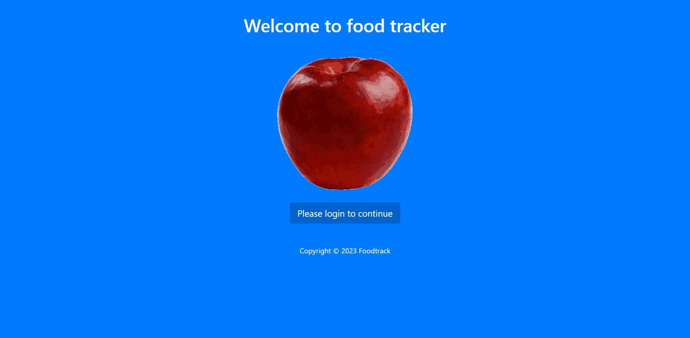
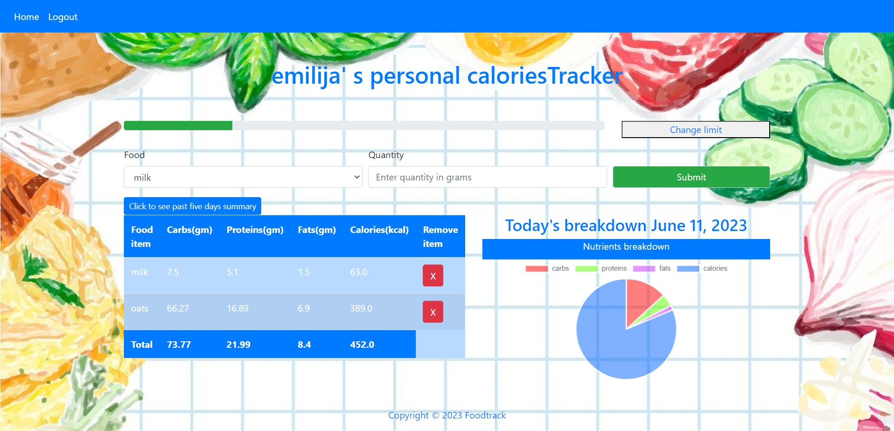
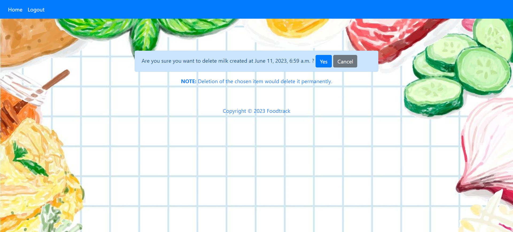
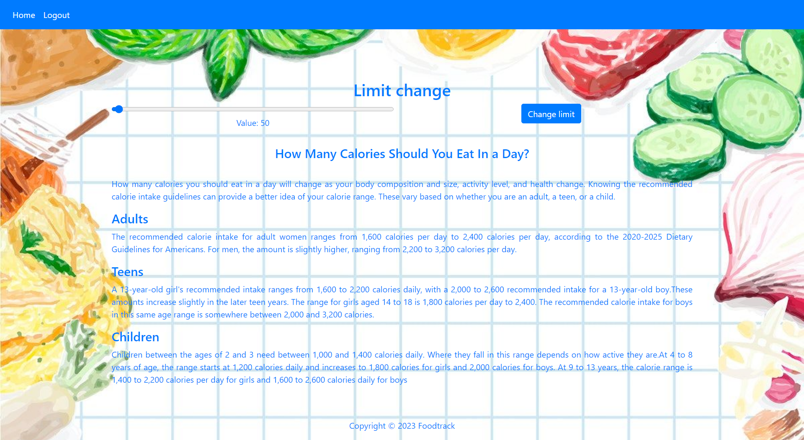
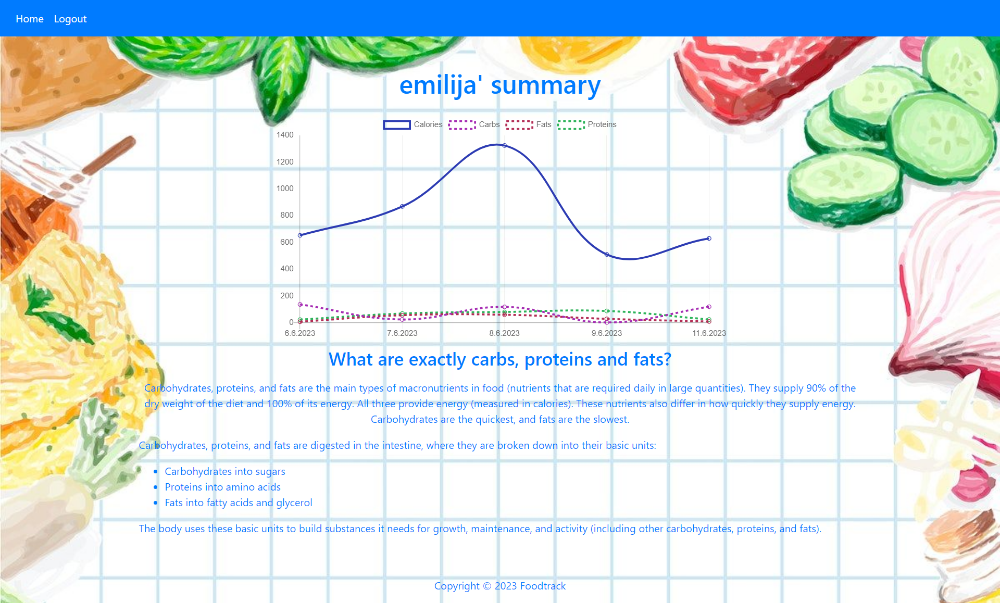
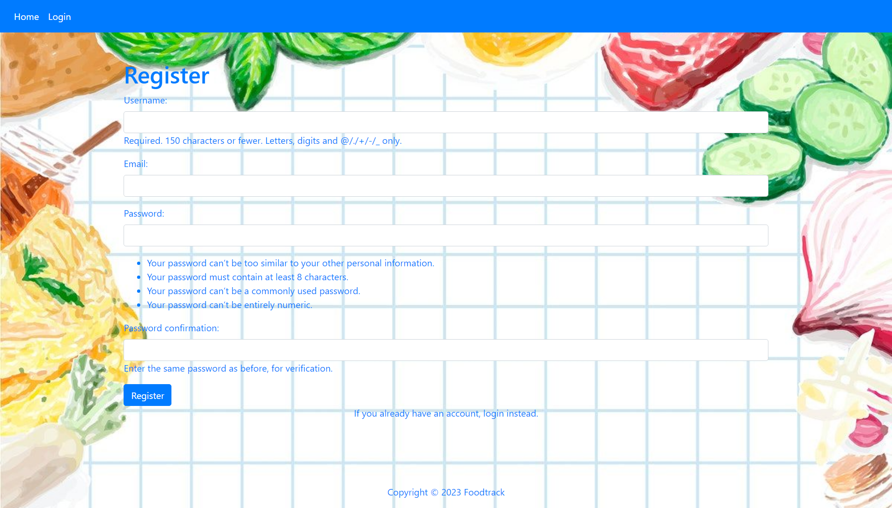
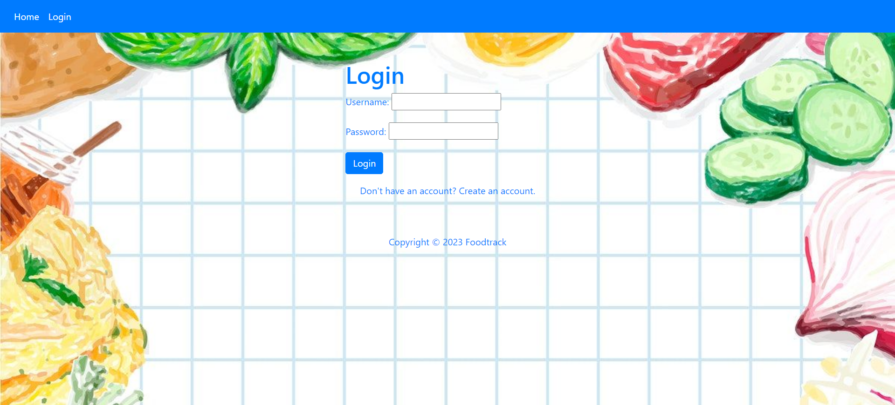

# My calorie tracker
Inspired by: https://github.com/nitish-gautam/django-calorie-tracker
Tasks: track calories,carbs, proteins fats from input food consumptions. Add, delete consumption. Observe today's consumption changes 
in the pie chart and table. Examine consumptions for the last five days (if entered data exist). Change calories limit. Log in, log out and register.

# Skill set
Django, Python, BootStrap, HTML, Javascript, CSS

# Installation
* 1 - clone repo 
* 2 - create a virtual environment and activate
* 3 - cd into project "calorieTracker"
* 4 - pip install -r requirements.txt
* 5 - python manage.py runserver

# Home Page if user is not logged in
  

# Home Page logged user
  

# Delete consume
  

# Change calories limit
  

# Five days summary
  

# Register
  

# Login

